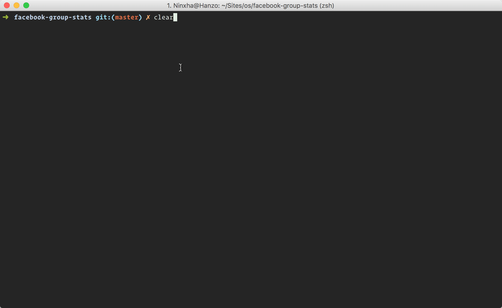

# FBG Stats
A simple node script that provides you statistics about your facebook group, currently the script provides you information regarding your top group posters. Due to the lack of data provided by the facebook API the script is not 100% accurate.

## Usage
1.  Clone repository
2.  Rename `.env.example` to `.env`
3.  Change the `GROUP_ID` to the id of the group you want to retrieve the statistics from
    **Note:** You should be a member of the group.
4.  Specify your facebook access token, you can get it from here https://developers.facebook.com/tools/explorer/ the permission `user_managed_groups` is required.
4.  Specify what kind of output you want to have, the current version supports a CLI table output as seen in the demo gif. As well as CSV file output.
5.  Run `node dist/index.js` in your terminal.
6.  Enjoy.

## Demonstration
